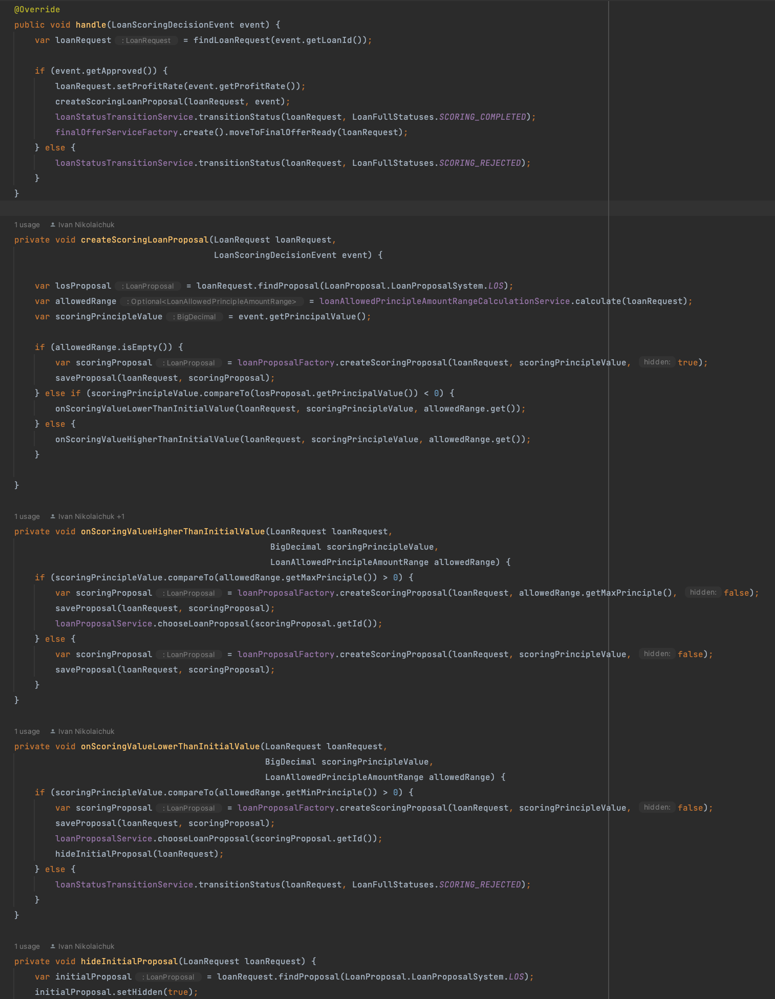
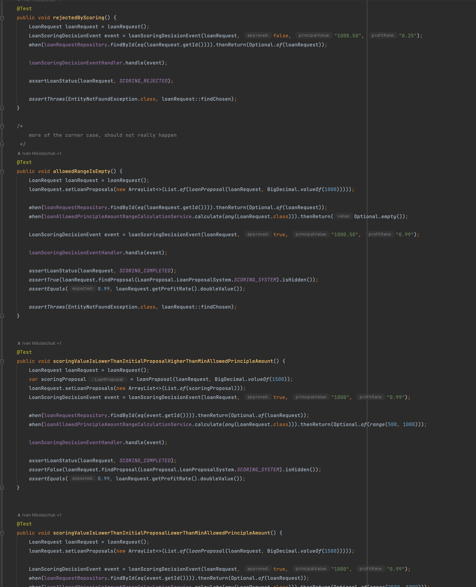

# System Test Framework

### Why do we need conventions?

We need conventions because we don't want to think more than necessary. 
We want to use our mental energy on solving project-specific problems, rather than problems that are common for all projects.

Besides we would like to open the project written by any of our colleagues and 'feel like home'. Read it: "as little surprises as possible". We don't want to familiarise ourselves with 'yet another project specifics', we want to agree on the best conventions one time and use them over and over.

### Overall approach to testing

High-quality product can be created only when developers are doing testing of their code. Tests should be in the same codebase and run everytime pipeline is executed.

There are different levels of testing:
- Unit testing - where a particular class is tested and all dependencies of this class are mocked.
- Integration testing - testing integrations that your application has
- System testing - launching and testing the entire application as a blackbox (with mocking integrations)
- E2E testing - testing the set of systems (services) as one working product that provides the functionality.

### Unit testing

Unit testing are very common and often done incorrectly. There are two main miss-usages I've seen:
- Some projects have no unit tests
- Some projects have 90% coverage rule and almost every class it unit tested

Both are anti-patterns, because having no tests lowers down the quality and having every class unit tested
lowers down the speed of development without significant increase of the quality.

Below is a perfect example of a class that needs to be unit-tested:

It has the following characteristics:
- Code does one main function (handling incoming event)
- It has a lot of if's

The unit test would test all if conditions (here's a part of the test)

### What is the System Test Framework?

The System Test Framework is our custom a Java-based testing framework that allows to:

1. Launch all the infrastructure that your application needs (postgres db, kafka)
2. Launch your application as a spring boot application connected to the infrastructure from step 1.
3. Execute step-by-step requests to your application via publicly exposed interfaces (rest and kafka), checking the correctness of the result.
4. Gracefully shut down the application and all infrastructure created for it.

It is expected that all new projects use the System Test Framework, to test business logic.

Detailed documentation: https://github.com/INK-Solutions/system-test-framework
