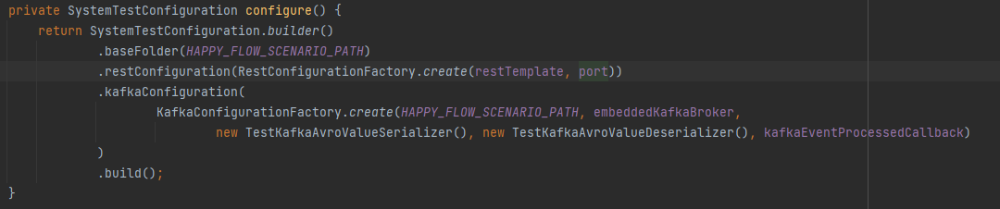

# System Test Framework

### Why do we need conventions?

We need conventions because we don't want to think more than necessary. 
We want to use our mental energy on solving project-specific problems, rather than problems that are common for all projects.

Besides we would like to open the project written by any of our colleagues and 'feel like home'. Read it: "as little surprises as possible". We don't want to familiarise ourselves with 'yet another project specifics', we want to agree on the best conventions one time and use them over and over.

### What is the System Test Framework?

The System Test Framework is our custom a Java-based testing framework that allows to:

1. Launch all the infrastructure that your application needs (postgres db, kafka)
2. Launch your application as a spring boot application connected to the infrastructure from step 1.
3. Execute step-by-step requests to your application via publicly exposed interfaces (rest and kafka), checking the correctness of the result.
4. Gracefully shut down the application and all infrastructure created for it.

It is expected that all new projects use the System Test Framework, to test business logic.

[System Test Framework codebase](https://github.com/INK-Solutions/system-test-framework)

### Motivation
We use the System Test Framework to make sure that all required steps of the business logic have been executed and the result of the processing is correct.

### How it works
With System Test Framework you can treat the application that you test as a black box. We start the application with embedded database and embedded kafka (if required).
Then we define set of steps that can send REST requests or/and Kafka events as input and validate if the output of the processing is correct.

### Example implementation

You can see example implementation of the System Test Framework in our reference project.
You can download the reference project from [here](https://github.com/INK-Solutions/reference-project.git).
Example system test implementation is created here: `src/test/java/tech/example/systemtest/DefaultSystemTest.java`

### Implementing System Test Framework

#### Dependencies

- Main dependency: `testImplementation 'house.inksoftware:system-test-framework'`
- `testImplementation 'org.springframework.boot:spring-boot-starter-test'`
- If you use Kafka in your project, you need also: `testImplementation "org.springframework.kafka:spring-kafka-test"`

#### Step-by-step guide on how to do it:
1. Create system test class that extends `AbstractSystemTest` of the System Test Framework
2. Add required annotations 
   - With `@TestExecutionListeners` you can define `ResourceLauncher` class that will initialize embedded database that you can use as you data source.
   
3. If your project uses Kafka, add autowire required classes:

   - `EmbeddedKafkaBroker` - Kafka broker for testing purposes
   - `SystemTestKafkaEventProcessedCallback` - your implementation of `KafkaEventProcessedCallback` from the System Test Framework. By default, it records id of the event that was processed as the result of step execution. 
4. Create configuration 
   - Where `HAPPY_FLOW_SCENARIO_PATH` is the path to the test steps' dir (request and expected responses) in test resources
   - `kafkaConfiguration` is optional, you need it when you use Kafka in your project
5. Create `application-test.properties` file
   
6. Create System Test 

### Creating system test

#### Test steps
Test steps are created with RequestStep class.

RequestStep builder take step's name as a parameter - this is a name of a directory in test resources which contains `request` and `response` subdirs.
##### Requests
`request` directory is a dir where you define your request. It supports two request types, REST and Kafka:
- `rest-request.json` is recognized as REST request
- `kafka-request.json` is recognized as Kafka request
##### Responses
`response` directory contains expected responses from the step's execution.
- `rest-response.json` is recognized as REST response
- `event.json` is an expected Kafka event that should be sent as the result of step execution.
- `kafka-request-processed.json`  it validates that Kafka request event (`kafka-request.json`) was processed.

##### Callbacks and placeholders
RequestStep's builder provides `callbackFunction` and `requestPlaceholders` methods.
You can use them to store data from the step processing and then use it next steps if needed.
`callbackFunction` is executed at the end of step processing.

Example:

In this example we defined `TestExecutionContext` that stores `loanId`.
1. First step `1-create-loan` uses `callbackFunction` of `response -> testExecutionContext.setLoanId(response.read("id"))` to save the `loanId` which is created as the result of step execution.
2. Second step `2-receive-decision"` uses `requestPlaceholders` of `JsonUtils.JsonRequestPlaceholder.of("loanId", testExecutionContext.getLoanId())` that replaces `{{loanId}}` placeholder in `kafka-request.json` file to verify that Kafka event that was produced as the result of this step execution, was created for this specific `loanId`
