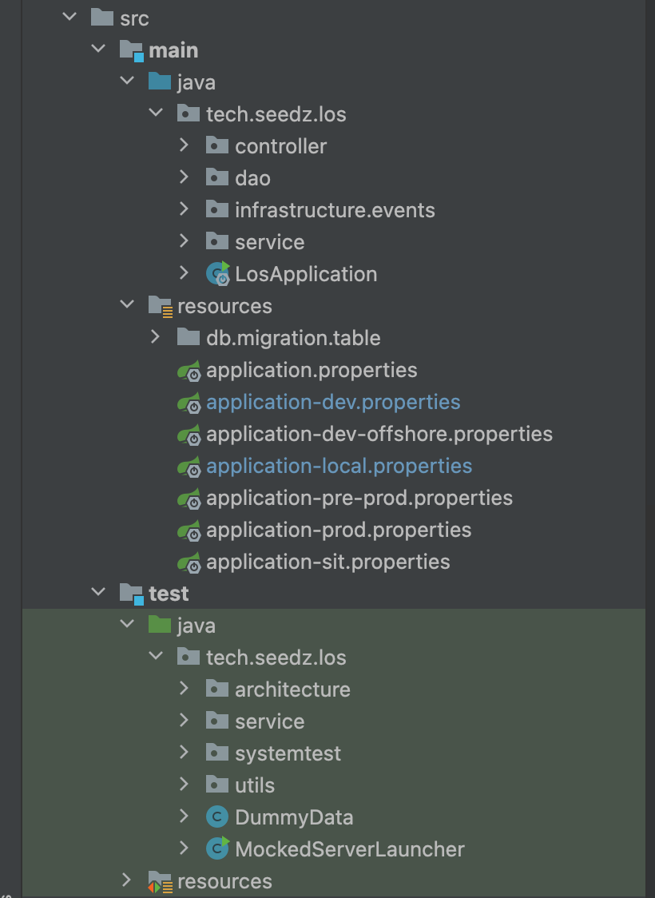
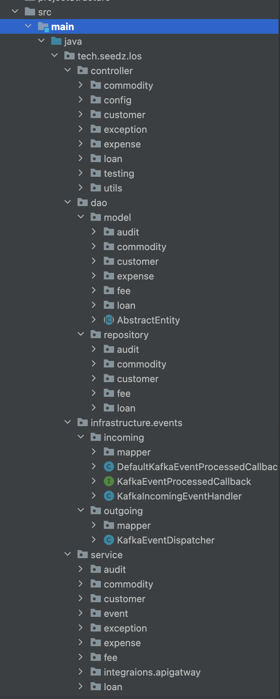
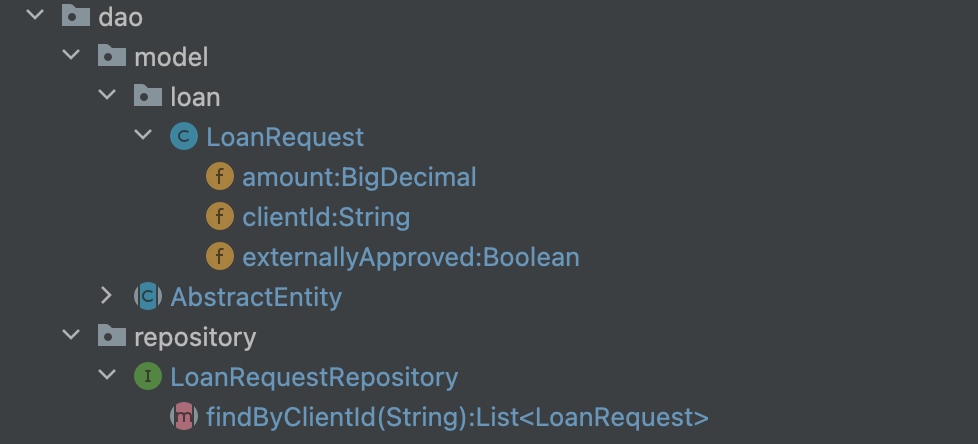
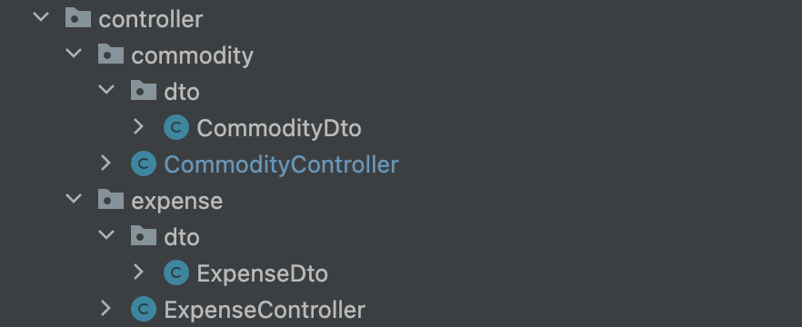
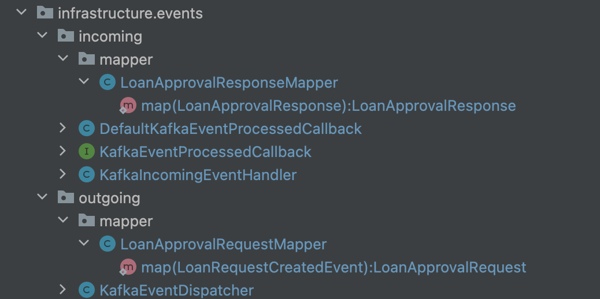
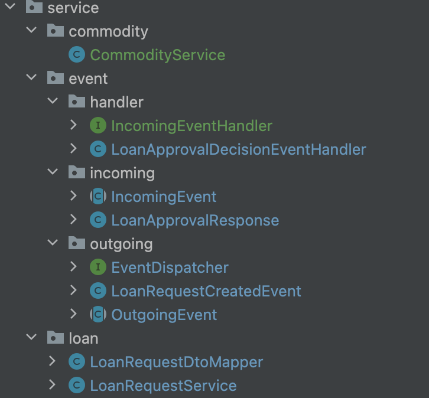

# Project structure

### Why do we need conventions?

We need conventions because we don't want to think more than necessary. 
We want to use our mental energy on solving project-specific problems, rather than problems that are common for all projects.

Besides we would like to open the project written by any of our colleagues and 'feel like home'. Read it: "as little surprises as possible". We don't want to familiarise ourselves with 'yet another project specifics', we want to agree on the best conventions one time and use them over and over.   

### High-level project structure

High-level our structure for any project would look like this: 

1. Everything is behind root package (`tech.seedz.los` in this case). It contains root package for organisation: `tech.seedz` and project name `los`.
2. There is a separate package for `controller`, `service`, `dao`, `infrastructure` packages. no other packages are allowed under the root.
3. Under `resources` package we have `application.properties` and `application-<profile>.properties`. It's important to have all profile properties from day one (not following this rule would cause problems when deploying to env with missing properties file). For preprod and prod those files can be left empty. 
4. There's a `db.migration.table` that contains flyway migration scripts (if the project has database).
5. Packages under `test` are mimicking one-to-one the structure under `java`. 

### Concept of subdomain packages 

Before discussing core structural packages (`controller`, `service`, `dao`, `infrastructure`) we need to understand the concept of subpackages.

In a nutshell every project is created to address a certain domain problem, and it naturally has subdomains.

Let's take a simple example of creating the service responsible for order processing in an e-commerce shop. 

To process an order client has to add a credit card to his profile, choose products and pay. 

Writing all the logic for these functionality in one package is a clear anti-pattern, so we would split the logic into subpackages. But how do we split?

One of the common approaches is splitting by subdomains. In the example of our project subdomain would be:  `client`, `order`, `creditcard`, `payment`. 

Services in subdomains are working with each other to fulfil the main application need.  

Split on subdomain packages is present in `controller`, `service` and `dao`:

## Core structural package: Dao

Depends on layers: none.

Dao package inside looks like this:

Dao is the simplest layer in the list.

It's purpose is to define database tables and provide a way to extract and manipulate data in those tablex in object-oriented manner.  

Packages are split into:
- model - contains subdomain packages, where each subdomain package has entities that represent tables in the database (mapping between tables and classes is done via ORM framework like Hibernate)  
- repository - contains subdomain packages, where each subdomain package has repositories that provide dao access (crud operations) to the defined models (tables).

## Core structural package: Controller 

Depends on layers: service.

Controller package inside looks like this:

The main purpose of this layer is to serve as a first layer to the external world, delegate to service layer to perform business logic and return the result. 

Packages are split into subdomains, where each subdomain package contains: 
- Controller (the first  to the application when making REST calls)
- Dto (Domain transfer objects) - contract from/to external world 

## Core structural package: Infrastructure 

Depends on layers: service.

This layer is optional and should be created only if application has outgoing / incoming events. 

The main purpose of this layer is to encapsulate infrastructural details of event orchestration and event message contract.

Let's say we use Kafka as a message broker and Apache Avro as a message-contract for events in kafka topic (these are details of our infrastructure). Somewhere in application we need to have a hard dependency on both Kafka and Avro. 

Where? Not in services package, because service is concerned about business logic, it should not know about infrastructural details. 

Packages are split into:
- incoming: contains the logic of reading from kafka, mapping kafka event to domain object and delegating to the service handler for event processing
- outgoing: contains the logic of handling domain event, mapping it to kafka event and pushing to the appropriate kafka topic.

## Core structural package: Service 

Depends on layers: controller (only because it needs dtos defined there), dao.

Service package inside looks like this:

Service layer is a heart of any application. It's core purpose is to connect all external inputs (controller and infrastructure) and perform the necessary business logic.

Packages contain:
- Package subdomains, where each subdomain package contains subdomain specific logic.
- event, that is split into:
  - incoming - defines a list of incoming events (contract-agnostic)
  - outgoing - defines a list of outgoing events (contract-agnostic)
  - handler - defines a logic of processing incoming events
