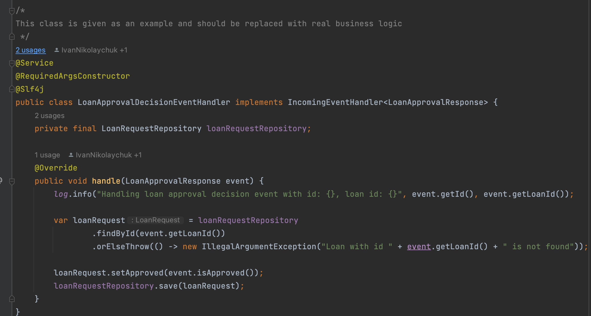

# Reference project

### Why do we need conventions?

We need conventions because we don't want to think more than necessary. 
We want to use our mental energy on solving project-specific problems, rather than problems that are common for all projects.

Besides we would like to open the project written by any of our colleagues and 'feel like home'. Read it: "as little surprises as possible". We don't want to familiarise ourselves with 'yet another project specifics', we want to agree on the best conventions one time and use them over and over.   

### Link 

You can download the reference project from [here](https://github.com/INK-Solutions/reference-project.git).

### What is a reference project?

Every time we create a new project in our organisation we don't need have to do it from scratch. There is a reference project, which is a template for all new projects. It contains:

- A proper project structure as per [project structure conventions](../project-structure/Main.md) 
- A proper testing approach as per [approach to testing conventions](../approach-to-testing/Main.md) 
- A proper coding principles that allow to [protect the codebase](../protecting-the-codebase/Main.md) 
- A proper rest endpoint design as per [rest endpoint conventions](../rest-endpoints-conventions/Main.md) 
- A [reference technology](../reference-technology/Main.md) stack 

### Business logic of the reference project

The reference project's main purpose is to help to kickstart development of a new project faster and to demonstrate the best design practices on the example of the simple application. 

To do that reference project needs to have a simple business logic that would be replaced with a business logic that is specific for new project. Reference project is meant to inspire and demonstrate how business logic should be structured when done properly.

Every class that is to be replaced with a real business logic is marked with a comment like: "This class is given as an example and should be replaced with real business logic". When building a new project from the reference project make sure that all classes with this comment are replaced.

Business logic of the reference project is the following:

- It's a loan processing application that exposes a REST endpoint for creating a new loan for the client.
- On every loan creation it emits a new loan creation event via kafka.
- It listens to loan approval events that are coming from an external approval system via kafka.
- It exposes REST API that allows to query loan details. 

Let's go through how this business functionality is implemented. We would do a layer by layer analysis, taking a look at the essential .

## Dao layer

At the core of dao layer there's an `AbstractEntity` that all other entities extend from:

When adding a new row to database we would like to have:
1. An id of each record that is auto-generated (uuid)
2. Timestamp of record creation (for audit purposes)
3. Timestamp of record modification (for audit purposes)

`AbstractEntity` takes care of this common concerns, all project specific entities should just extend it.

All access to database level is managed by repository level that comes from SpringData and look like this:

## Controller layer

Controller class looks like this: 

Note that:

1. Every request entering the controller endpoint is first logged with the context relevant to the call. It's a must-have practice to follow, otherwise we would not know what's going on inside of the running application - logs are essential to understand it.
2. There's a hidden validation of the dtos that are inputs to api rest endpoints. `LoanRequestCreateDto dto` has a `@Valid` annotation before it. If you'll look inside of the dto class you'll see that fields are marked with `NotNull` annotations (it's just one of the possible constraints - there are many of them). Under the hood every rest request would be validated against defined constraints and if request doesn't satisfy them, caller of rest api would receive an exception response with a clear message of what constraints are violated. These validations are must-have, because it's an easy and fast way to validate the input without writing any extra code.    
3. Controller has no logic whatsoever. All it does is delegating to service layer that returns a dto as a response. Controller is the entrance to your application and it should only log and delegate.

Also let's take a look at exception handling class: 

Here's what happens: 

1. Service layer has a class `GenericException` that is an abstract class for all project-specific exception that extend from it.
2. Every GenericException has an error code and exception message. 
3. Controller catches all `GenericException`'s and converts them into the exception dto.

Thanks for this code any `GenericException` that is thrown from service level is converted into a unified exception api contract like:

`{"errorCode":"loan-already-given", "errorMessage":"Loan for customer fake-client-id was already given"}`

## Service layer

Service layer is a bastion of the business logic. It handles all application inputs (from rest and kafka) and delegates to `EventDispatcher` for event publishing.

### Handling controller requests

Here's a typical service class that controller layer delegates to: 

Note a couple of things here: 

1. There's a business-logic assertion that the service makes prior to request processing. Assertions are common for defencive programming style of codding and a must in any project. Note that the exception thrown extends `GenericException` class.
2. Methods are short and easy to read - as a rule of thumb the method should not be more than 20 code-lines.

### Abstractions for event dispatching and processing

In the screenshot above you saw that upon processing a rest request the service dispatches a `LoanRequestCreatedEvent` to kafka. Let's look into this in more details.

As a good practice to follow service level should not be aware of the infrastructural details, such as technology behind event broker (kafka) and contract of messages (apache avro).

However, service layer should know about: 

- Outgoing business events that occur in the system (and would be eventually pushed to kafka) 
- Incoming business events and the business logic of processing those events. 

The technical implementation to archive those points is presented below.

There's an abstract `OutgoingEvent` (defined in service level) that all outgoing business events extend from:

Those business events are POJO's and therefore are not aware of the actual schema of the event in kafka.

There's an `EventDispatcher` interface (defined in service level) that dispatches the `OutgoingEvent`.

Services that want to publish the event delegate to this interface. It's only an interface, therefore there is no dependency on kafka. The actual dependency on kafka would be hidden behind the implementation of this interface in infra layer (we would learn it later).

For incoming events approach is similar. There's an abstract `IncomingEvent` that all incoming business events extend from:

Those business events are POJO's and therefore are not aware of the actual schema of the event in kafka.

There's an `IncomingEventHandler` interface (defined in service level) that is an abstract class for all incoming event handlers.

The concrete event handler extends `IncomingEventHandler` and contains the entire business logic of processing events:

Again, since it depends only on incoming business events (POJO's), it's free from knowing the contract behind the actual business events (avro).  

## Infra layer

Infra level is concerned about hiding kafka integration details from service layer. So it knows about kafka and avro.

Here's an event dispatcher:

As you see it takes an `OutgoingEvent`, which is a business event (POJO), determines the type of this event, maps it to avro and dispatches to proper topic.

Here's an event handler:

As you see it listens to kafka events (avro), maps them to business events and delegates to the service level for processing.

## Testing

Note that the reference project has an `ArchitectureTest` (defines the rules of package dependencies) and `DefaultSystemTest` (system-tests the entire system).

You can read more about our testing strategy [here](../approach-to-testing/Main.md).