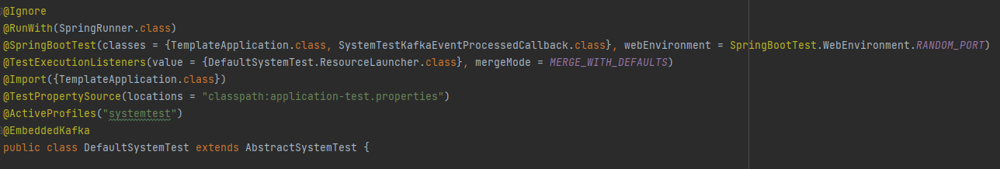
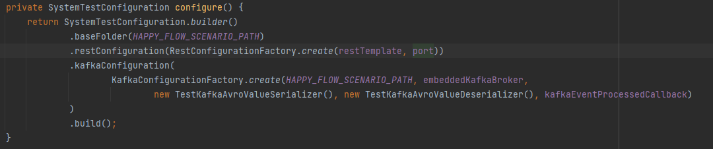
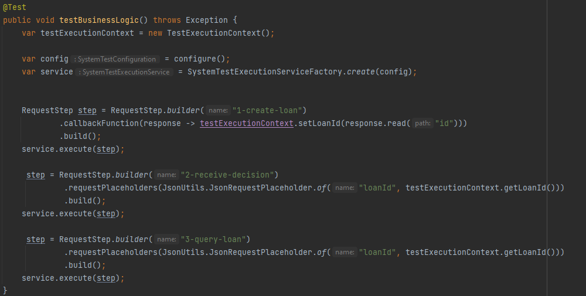
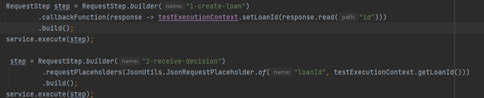
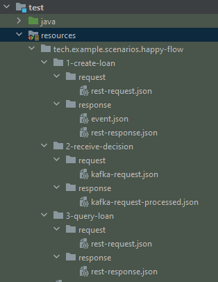

# Reference project

### Why do we need conventions?

We need conventions because we don't want to think more than necessary. 
We want to use our mental energy on solving project-specific problems, rather than problems that are common for all projects.

Besides we would like to open the project written by any of our colleagues and 'feel like home'. Read it: "as little surprises as possible". We don't want to familiarise ourselves with 'yet another project specifics', we want to agree on the best conventions one time and use them over and over.   

### Motivation

### Example implementation

You can see example implementation of the System Test Framework in our reference project.
You can download the reference project from [here](https://github.com/INK-Solutions/reference-project.git).
Example system test implementation is created here: `src/test/java/tech/example/systemtest/DefaultSystemTest.java`

### What is the System Test Framework?

The System Test Framework is a Java-based testing framework used for testing REST APIs, and Kafka-based messaging systems integrations. It provides tools for making HTTP requests, handling responses, and validating results, as well as built-in support for common testing practices specific to Kafka, such as producing and consuming Kafka messages, configuring Kafka brokers, and verifying message processing. The framework helps to create comprehensive and robust system-level tests to verify the functionality, and reliability of REST APIs, integrations, and Kafka-based messaging systems, improving overall system quality.
It is expected that all new projects use the System Test Framework, to test business logic.

### Implementing System Test Framework

#### Dependencies

- Main dependency: `testImplementation 'house.inksoftware:system-test-framework'`
- `testImplementation 'org.springframework.boot:spring-boot-starter-test'`
- If you use Kafka in your project, you need also: `testImplementation "org.springframework.kafka:spring-kafka-test"`

#### Step-by-step guide on how to do it:
1. Create system test class that extends AbstractSystemTest of the System Test Framework
2. Add required annotations 
3. Create configuration 
   - Where `HAPPY_FLOW_SCENARIO_PATH` is the path to the test steps' dir (request and expected responses) in test resources
4. Create System Test 

### Implementation details of the System Test Framework

#### Test steps
Test steps are created with RequestStep class.

RequestStep builder take step's name as a parameter - this is a name of a directory in test resources which contains `request` and `response` subdirs.
`request` directory is a dir where you define your request. It supports two request types, REST and Kafka:
- `rest-request.json` is recognized as REST request
- `kafka-request.json` is recognized as Kafka request
`response` directory contains expected responses from the step's execution.

